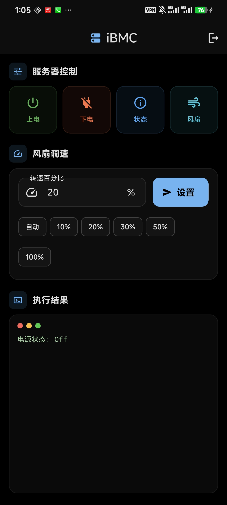

# iBMC 服务器管理

基于 Flutter 开发的华为 iBMC 服务器远程管理 Android 应用，通过 Redfish API 与 SSH 实现对服务器的电源控制、状态监控和风扇调速。

## 截图



## 功能

| 功能    | 说明                                                               |
| ----- | ---------------------------------------------------------------- |
| 服务器上电 | 通过 Redfish `ComputerSystem.Reset` 发送 `On` 指令                     |
| 服务器下电 | 通过 Redfish `ComputerSystem.Reset` 发送 `GracefulShutdown` 优雅关机     |
| 电源状态  | 查询 `Systems/1` 获取当前电源状态                                          |
| 风扇信息  | 查询 `Chassis/1/Thermal` 获取风扇模式与转速                                 |
| 风扇调速  | 支持 0-100% 手动调速，优先通过 SSH 执行 `ipmcset` 命令实现永久手动模式，Redfish API 作为备选 |

## 技术栈

- **框架**: Flutter 3.x + Dart
- **HTTP 客户端**: `http` 包，支持自签名证书
- **SSH**: `dartssh2` 包，直连 iBMC 执行 `ipmcset` 命令
- **本地存储**: `shared_preferences` 保存登录凭据
- **UI**: Material Design 3 + AMOLED 纯黑主题

## 项目结构

```
ibmc_app/
├── lib/
│   ├── main.dart                    # 应用入口，全局主题配置
│   ├── screens/
│   │   ├── login_screen.dart        # 登录页面
│   │   └── home_screen.dart         # 操作主页面
│   └── services/
│       └── redfish_service.dart     # Redfish API + SSH 服务层
├── android/                         # Android 原生配置
├── logo.png                         # 应用图标源文件
├── 截图1.jpg                        # 应用截图
└── pubspec.yaml                     # 项目依赖配置
```

## 依赖

```yaml
dependencies:
  http: ^1.2.0              # HTTP 请求
  dartssh2: ^2.11.0         # SSH 客户端
  shared_preferences: ^2.5.3 # 本地键值存储

dev_dependencies:
  flutter_launcher_icons: ^0.14.3 # 应用图标生成
```

## 构建

### 环境要求

- Flutter SDK >= 3.11.3
- Android SDK (API 21+)
- JDK 17+

### 安装依赖

```bash
flutter pub get
```

### 生成应用图标

```bash
dart run flutter_launcher_icons
```

### 构建 APK

```bash
flutter build apk --release
```

APK 输出路径: `build/app/outputs/flutter-apk/app-release.apk`

### 直接安装到设备

```bash
flutter install
```

## 使用说明

1. 打开应用进入登录页面
2. 输入 iBMC 服务器的 **IP 地址**、**用户名**、**密码**
3. 点击 **保存并登录**（下次打开自动填充）或 **仅登录**
4. 登录成功后进入操作页面：
   - **服务器控制**: 上电 / 下电 / 电源状态 / 风扇信息
   - **风扇调速**: 输入百分比或点击快捷芯片（自动/10%/20%/30%/50%/100%），点击设置
   - **执行结果**: 终端风格输出区域显示操作返回信息
5. 点击右上角退出按钮返回登录页

## 风扇调速原理

风扇调速优先使用 SSH 直连 iBMC 执行华为 OEM 命令：

```bash
# 设置手动转速
ipmcset -d fanlevel -v <百分比>

# 切换为手动模式（永久）
ipmcset -d fanmode -v 1 0

# 恢复自动模式
ipmcset -d fanmode -v 0
```

若 SSH 不可用，自动回退到 Redfish API：

```json
PATCH /redfish/v1/Chassis/1/Thermal
{
  "Oem": {
    "Huawei": {
      "FanSpeedAdjustmentMode": "Manual",
      "FanSpeedLevelPercents": <百分比>,
      "FanManualModeTimeoutSeconds": 0
    }
  }
}
```

> **注意**: 服务器重启后风扇模式会恢复为自动。

## 权限

- `INTERNET`: 网络通信
- `ACCESS_NETWORK_STATE`: 检测网络状态
- `usesCleartextTraffic`: 允许 HTTP 明文（用于内网 iBMC 连接）

## License

MIT